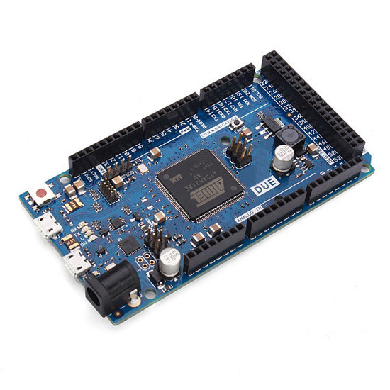
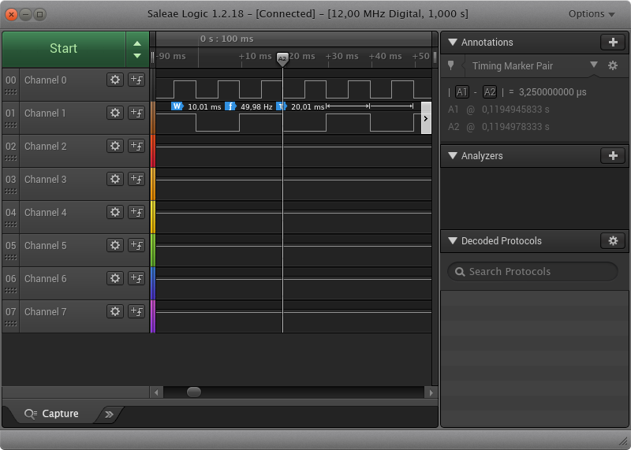
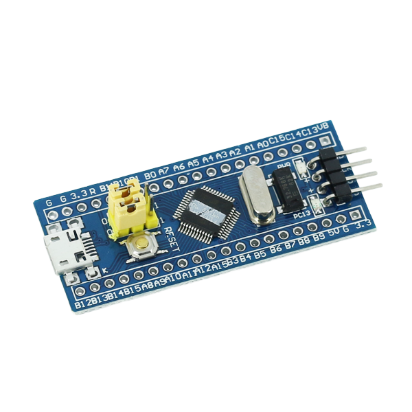
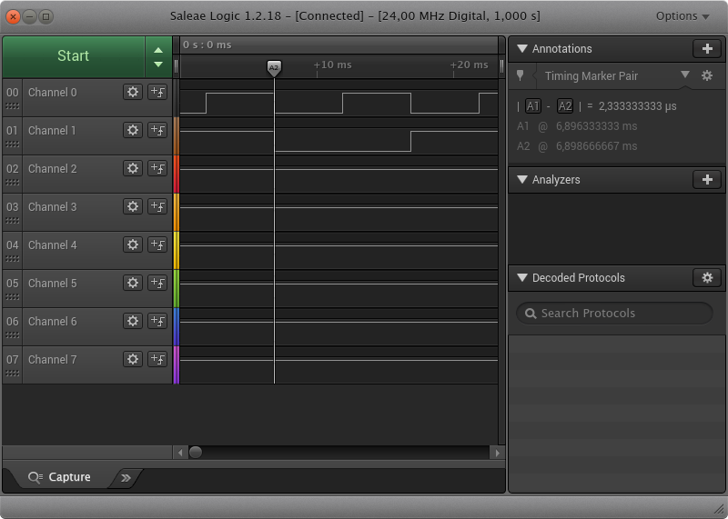
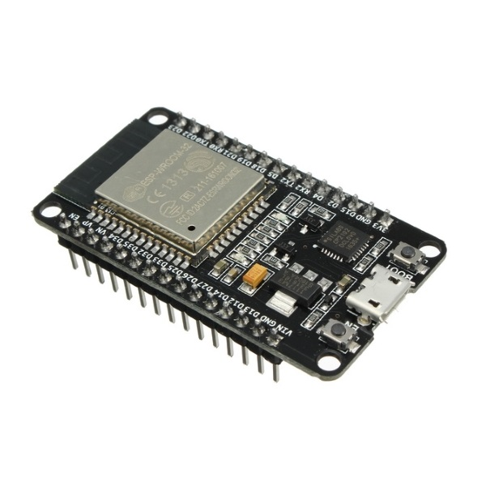
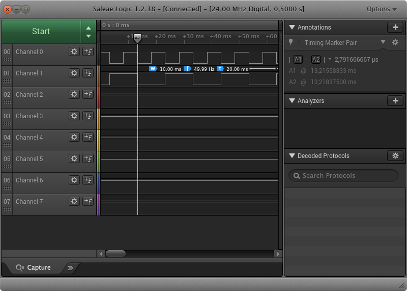
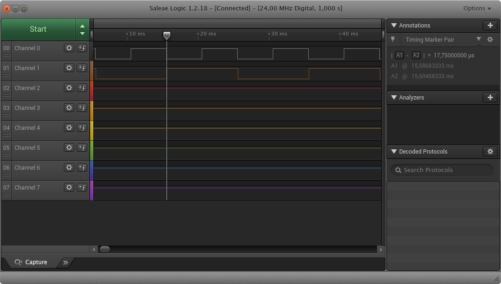

# Interrupt implementation and evaluation

The interruption is an important resource when using a microcontroler, and the easiest way to implement an interruption is using Arduino library.

## ATmega328p - Arduino Uno/Nano

The most common and wide spread plataform is the ATmega328p, in which the Arduino IDE is straight forward.


### Functions

The arduino define some functions that come to handy, such as `pinMode`,  `attachInterrupt` and `digitalWrite`. These are enough for the evaluation.

 Mainly, the pin function must be defined,

```c
pinMode(pin_out, OUTPUT);
pinMode(pin_Interrup, INPUT_PULLUP);
```

also, the pin which will be working as an interruption.

```c
attachInterrupt(digitalPinToInterrupt(pin_Interrup), isr_Interruption, FALLING);
```

`isr_Interruption` is the function to be called when the pin is trigger from falling edge. The result shows that it took 11.75us to change the state of the pin after the interrupt is triggered. We can approximate that number to 188 clock cycles.


### AVR Registers

Registers can be little tricky and must follow microprocessor datasheet.
Using `INT2`, which is pin 2, we define it as input,

```c
DDRD &= ~(1 << DDD2); // Low
```

and put a pull up.

```c
PORTD |= (1 << PORTD2); // High
```

After that, the interruption is enabled.

```c
EIMSK |= (1 << INT2); //High
EICRA |= (1 << ISC21); // High
EICRA &= ~(1 << ISC20); // Low
```

Also, enable the pin 5 as output.

```c
DDRD |= (1 << DDD1); // High
```

To toogle the port, we use a xor.

```c
PORTD ^= (1 << PORTD2);
```

Using direct access register, it took 1.5us.


Clearly, using pre-difined functions are easier to develop. Programming using registers took time to read, configure and test if the output is accordingly.

Full code can be accessed [here](avr/) .

## Arduino Due

In some cases, we just squeeze the chip to reach some desired output. From that poit, there are two options:
1.  Just *Bit twiddler*, or
2. improove the hardware.

Arduino Due was first oficial Arduino ARM based board with Cortex-M3 32bit. The chip has a 84MHz suport and is presented bellow.



The same code is used and the result presented bellow.



The result, as expected shown a response time of 1.5us. A considerably performance increase using Arduino lib.
Despite of what people think, the clock cycle isn't linear with speed. It mainly depends on microprocessor arquiteture.

## STM32

A extremely cheap and good alternative is the Maple Mini / Blue Pill STM32F103C Series. This chip has full arduino support. The chip and its results are presented bellow.



### Arduino

Using the arduino lubrary, the results are:



A better performance for a cheapper and smaller board with ARM Cortex-M3 and 72MHz. The time to process the result took only 2.33us.

However, the question remains. Can we increase that behaviour using native HAL drives provided by STM32?

*TESTS*

## ESP32

ESP32 is a good and cheap hardware. The drawback is that documentation is not so good. Mainly user use it for IoT purposes, which doesn't demand real time applications and times are not so important.



### Arduino

The same code was applied and the result keeps Due and Bluepill.



Also better than Arduino Due, but still looses to Bluepill. ESP32 can reach 240MHz 32bit LX6.

### Micropython

Another advantage of the ESP32 is micropython. It's possible to program the chip using high level languace, such as python.

A simple code can trigger the expected result as presented above.

```python
import machine

def handle_interrupt(pin):
    global out_pin
    out_pin.value( not out_pin.value() )

out_pin = machine.Pin(21, machine.Pin.OUT)
int_interrup = machine.Pin(16, machine.Pin.IN)
int_interrup.irq(trigger=machine.Pin.IRQ_RISING, handler=handle_interrupt)
```

However, there is clear a trade-off pointed from the result bellow.


It took amazingly 38us to change the pin state. I must say that is quite disapponting.

#### PyB

For a pyb v1.1, the performance is different.



The execution took 17.75us.

### Arduino

In order to check if this is a Micropython restrain, let's use arduino library again.
