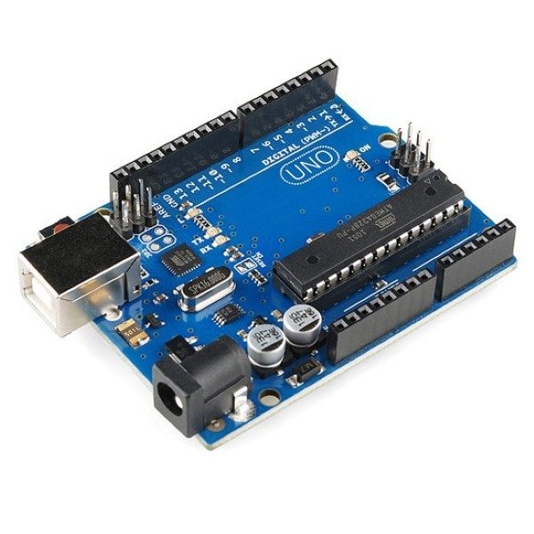
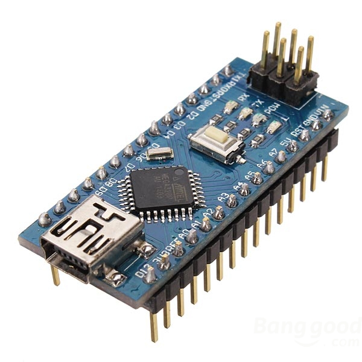
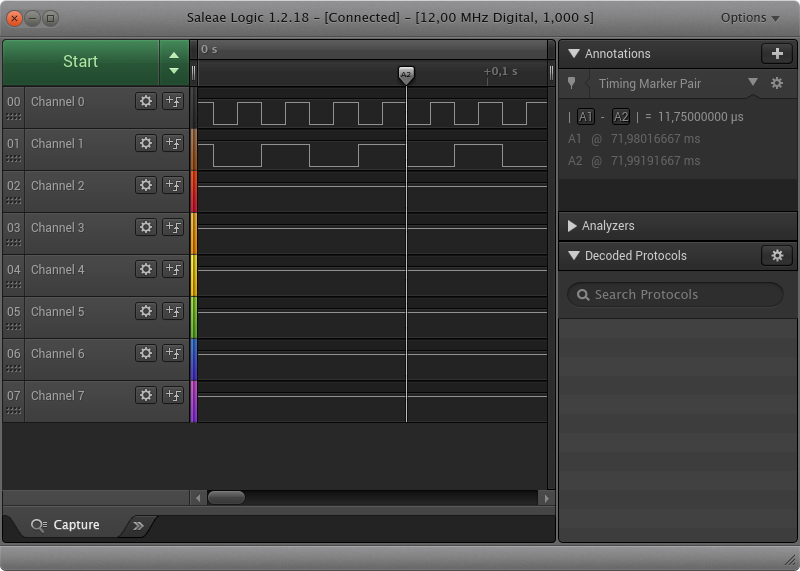
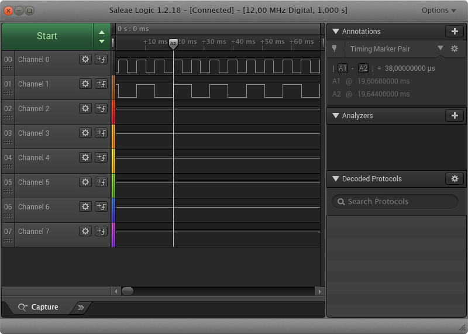

# Interrupt implementation and evaluation

The interruption is an important resource when using a microcontroler, and the easiest way to implement an interruption is using Arduino library.

## ATmega328p -- Arduino Uno/Nano

The most common and wide spread plataform is the ATmega328p, in which the Arduino IDE is straight forward.





### Functions

The arduino define some functions that come to handy, such as `pinMode`,  `attachInterrupt` and `digitalWrite`. These are enough for the evaluation.

 Mainly, the pin function must be defined,
	
```
pinMode(pin_out, OUTPUT);
pinMode(pin_Interrup, INPUT_PULLUP);
```

also, the pin which will be working as an interruption.

```
attachInterrupt(digitalPinToInterrupt(pin_Interrup), isr_Interruption, FALLING);
```

`isr_Interruption` is the function to be called when the pin is trigger from falling edge. The result shows that it took 11.75us to change the state of the pin after the interrupt is triggered. We can approximate that number to 188 clock cycles.




### AVR Registers

Registers can be little tricky and must follow microprocessor datasheet.
Using `INT2`, which is pin 2, we define it as input,

```
DDRD &= ~(1 << DDD2); // Low
```

and put a pull up.

```
PORTD |= (1 << PORTD2); // High
```

After that, the interruption is enabled.

```
EIMSK |= (1 << INT2); //High
EICRA |= (1 << ISC21); // High
EICRA &= ~(1 << ISC20); // Low
```

Also, enable the pin 5 as output.

```
DDRD |= (1 << DDD1); // High
```

To toogle the port, we use a xor.

```
PORTD ^= (1 << PORTD2);
```

Using direct access register, it took 1.5us.


Clearly, using pre-difined functions are easier to develop. Programming using registers took time to read, configure and test if the output is accordingly.

Full code can be accessed [here](avr/) .

## ESP32

In some cases, we just squeeze the chip to reach some desired output. From that poit, there are two options:
1.  Just *Bit twiddler*, or
2. improove the hardware.

ESP32 is a good and cheap hardware. The drawback is that documentation is not so good. Mainly user use it for IoT purposes, which doesn't demand real time applications and times are not so important.

### Micropython

Another advantage of the ESP32 is micropython. It's possible to program the chip using high level languace, such as python. 

A simple code can trigger the expected result as presented above.

```
import machine

def handle_interrupt(pin):
    global out_pin
    out_pin.value( not out_pin.value() )

out_pin = machine.Pin(21, machine.Pin.OUT)
int_interrup = machine.Pin(16, machine.Pin.IN)
int_interrup.irq(trigger=machine.Pin.IRQ_RISING, handler=handle_interrupt)
```

However, there is clear a trade-off pointed from the result bellow.



It took amazingly 38us to change the pin state. I must say that is quite disapponting. 

### Arduino

In order to check if this is a Micropython restrain, let's use arduino library again.